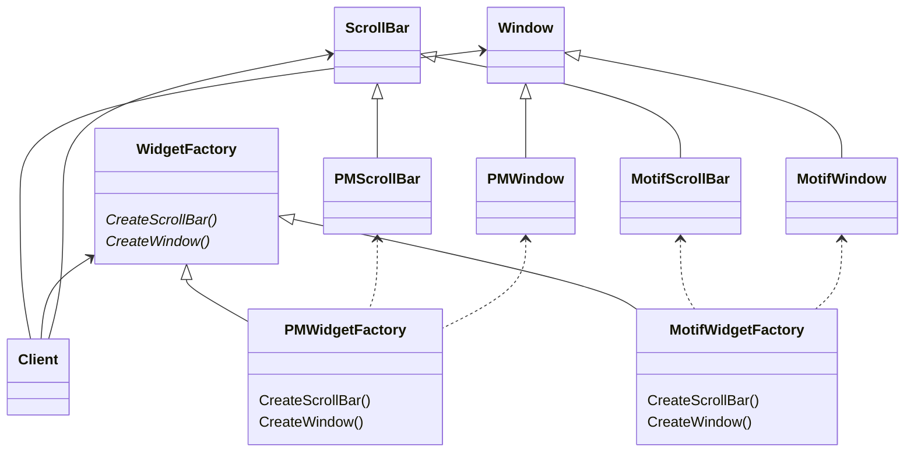

Абстрактная фабрика - паттерн, порождающий объекты
## Назначение
Предоставляет интерфейс для создания семейств взаимосвязанных или взаимозависимых объектов, не специфицируя их конкретных классов.
## Применимость
- система не должна зависеть от того, как создаются, компонуются и представляются входящие в нее объекты
- система должна настраиваться одним из семейств объектов
- входящие в семейство взаимосвязанные объекты спроектированы для совместной работы, и вы должны обеспечить выполнение этого ограничения
- вы хотите предоставить библиотеку объектов, раскрывая только их интерфейсы, но не реализацию
## Структура

# Участники

- `AbstractFactory` - абстрактная фабрика
	- объявляет интерфейс для операции, создающих абстрактные объекты-продукты
- `ConcreteFactory` - конкретная фабрика
	- реализует операции, создающие конкретные объекты-продукты
- `AbstractProduct` 
	- объявляет интерфейс для типа объекта-продукта
- `ConcreteProduct`
	- Определяет объект-продукт, создаваемый соответствующей конкретной фабрикой
- `Client` пользуется исключительно интерфейсами `AbstractFactory` и `AbstractProduct`
# Отношения
- обычно во время выполнения создается единственный экземпляр класса `ConcreteFactory`. Эта конкретная фабрика создает объекты-продукты, имеющие вполне определенную реализацию. Для создания других видов объектов клиент должен воспользоваться другой конкретной фабрикой
- `AbstractFactory` передает создание объектов-продуктов своему подклассу
# Результаты
1. *изолируются конкретные классы*. Паттерн помогает контролировать классы объектов, создаваемых приложением. Поскольку фабрика инкапсулирует ответственность за создание классов и сам процесс их создания, то она изолирует клиента от подробностей реализации классов. Клиенты манипулируют экземплярами через их абстрактные интерфейсы. В коде клиента не упоминаются имена изготавливаемых классов.
2. *упрощает замену семейств продуктов*. Класс конкретной фабрики появляется в приложении только один раз: при создании экземпляра. 
3. *гарантирует сочетаемость продуктов*. Если продукты некоторого семейства спроектированы для совместного использования, то важно, чтобы приложение в каждый момент времени работало только с продуктами единственного семейства.
4. *не упрощает задачу поддержки нового вида продуктов*. Расширение абстрактной фабрики для изготовления новых видов продуктов - непростая задача.
# Реализация
[GitHub](https://github.com/akarmanov2022/design-patterns-java/blob/c8c38d0f1a32add6b0a1014b76973f5e25740643/patterns/abstract-factory)
