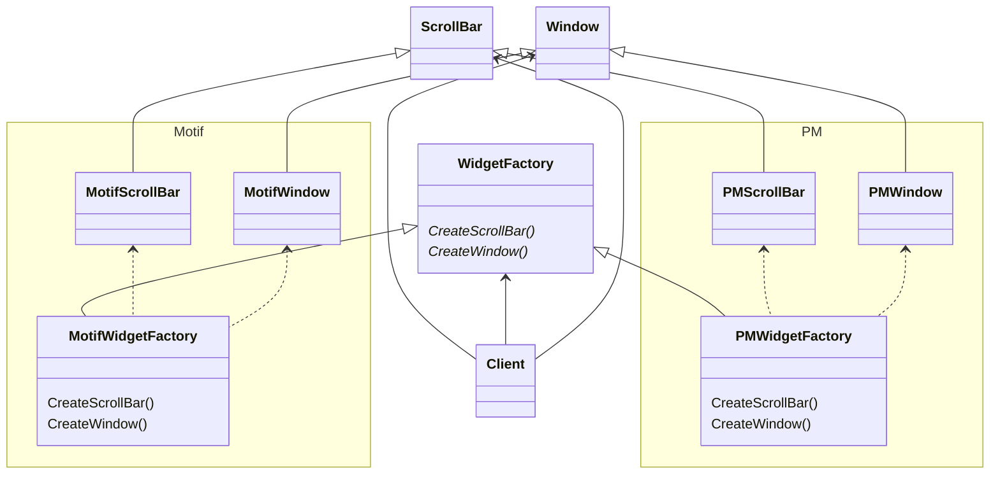

## Название и классификация
Абстрактная фабрика - паттерн, порождающий объекты
## Назначение
Предоставляет интерфейс для создания семейств взаимосвязанных или взаимозависимых объектов, не специфицируя их конкретных классов.
## Применимость
- система не должна зависеть от того, как создаются, компонуются и представляются входящие в нее объекты
- система должна настраиваться одним из семейств объектов
- входящие в семейство взаимосвязанные объекты спроектированы для совместной работы, и вы должны обеспечить выполнение этого ограничения
- вы хотите предоставить библиотеку объектов, раскрывая только их интерфейсы, но не реализацию
## Структура

