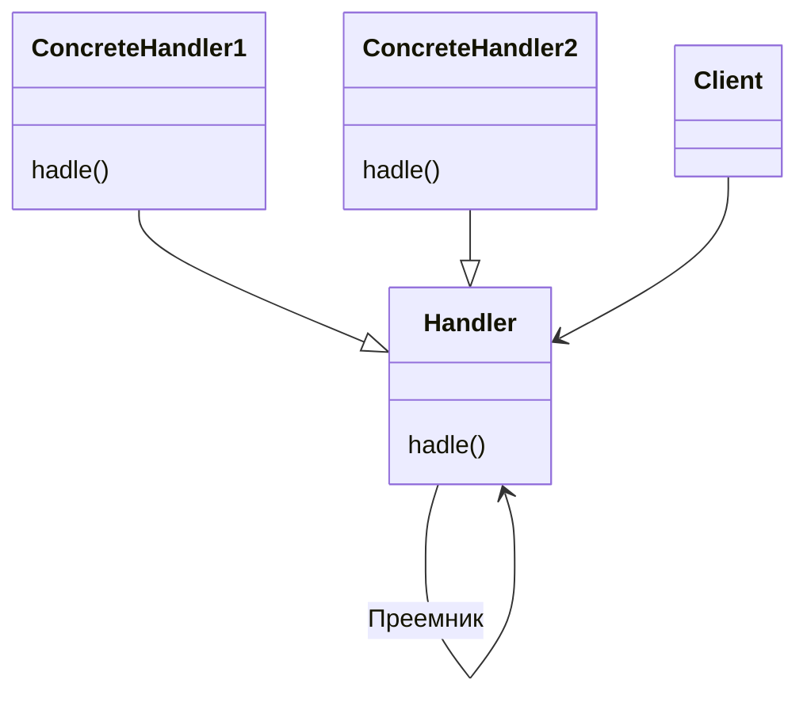

---
tags:
  - DesignPatterns
  - ООП
links: []
---

# Название и классификация
Паттерн поведения объектов
# Назначение
позволяет избежать привязки отправителя запроса к его получателю, предоставляя возможность обработать запрос нескольким объектам. Связывает объекты-получатели в цепочку и передает запрос по этой цепочке, пока он не будет обработан.
# Применимость
1. запрос может быть обработан более чем одним объектом, причем настоящий обработчик заранее неизвестен и должен быть найден автоматически
2. запрос должен быть отправлен одному из нескольких объектов, без явного указания, какому именно
3. набор объектов, способных обработать запрос, должен задаваться динамически.
# Структура

# Участники
- **Handler** - обработчик
	- определяет интерфейс для обработки запросов
	- (необязательно) реализует связь с преемником
- **ConcreteHadler** - конкретный обработчик
	- обрабатывает запрос, за который отвечает
	- имеет доступ к своему преемнику
- **Client** - клиент
	- отправляет запрос некоторому объекту в цепочке
# Отношения
Запрос, инициированный клиентом, продвигается по цепочке, пока некоторый объект `ConcreteHadler` не возьмет на себя ответственность за его обработку.
# Результаты
- ослабление свзяности
- дополнительная гибкость при распределении обязанностей между объектами
- получение ответа на запрос не гарантировано

