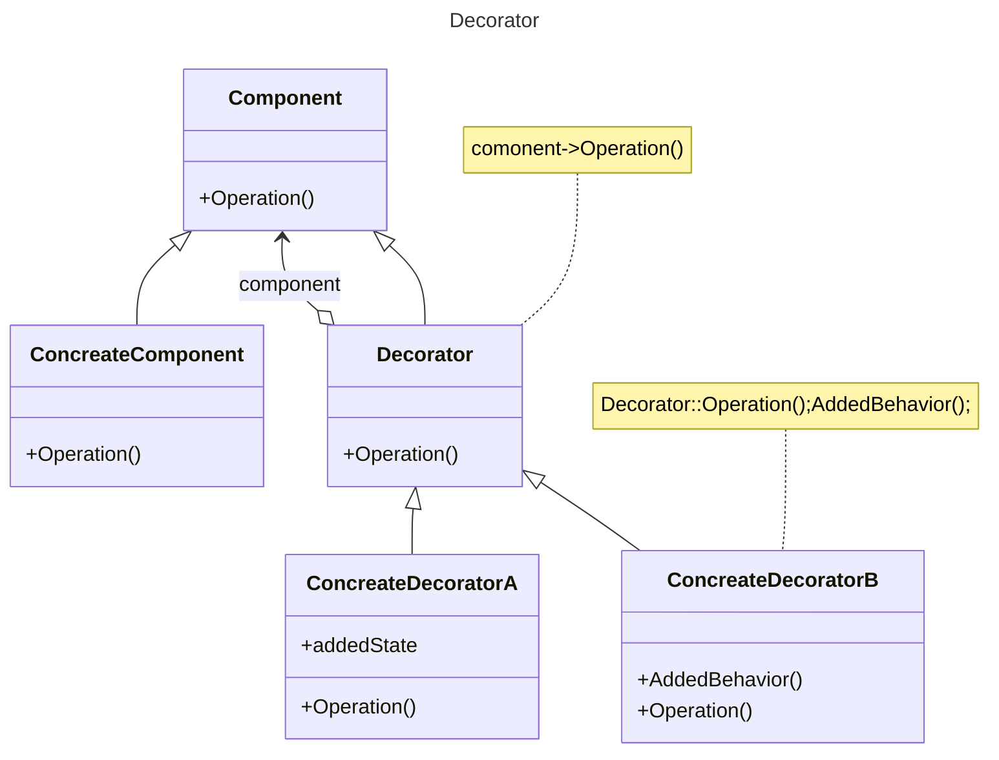

---
tags:
  - DesignPatterns
links:
  - "[[Структурные паттерны]]"
---
# Назначение
Динамически добавляет объекту новые обязанности. Является гибкой альтернативой порождению подклассов с целью расширить функционал.
# Применимость
- динамическое, прозрачное для клиентов добавление обязанностей объектам (при этом другие объекты не затрагиваются)
- реализация обязанностей, которые могут быть сняты с объекта
- расширение путем порождения подклассов по каким-то причинам не удобно или невозможно. Иногда приходится реализовывать много независимых расширений, так что порождение подклассов для поддержки всех возможных комбинаций приведет к стремительному росту их числа.
# Структура

# Отношения
`Decorator` переадресует запросы объекту `Component`. Может выполнять и дополнительные операции до и после переадресации.

# Плюсы
- *Позволяет избежать перегруженных функциями классов на верхних уровнях иерархии*. Декоратор позволяет добавлять новые обязанности по мере необходимости.
# Минусы
- *Декоратор и его компонент не идентичны.*
- *Множество мелких объектов*

