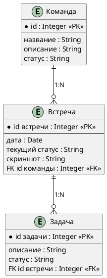

#⚛️ 

```plantuml
@startuml

entity "Команда" {
  * id : Integer <<PK>>
  --
  название : String
  описание : String
  статус : String
}

entity "Встреча" {
  * id встречи : Integer <<PK>>
  --
  дата : Date
  текущий статус : String
  скриншот : String
  FK id команды : Integer <<FK>>
}

entity "Задача" {
  * id задачи : Integer <<PK>>
  --
  описание : String
  статус : String
  FK id встречи : Integer <<FK>>
}

' Взаимосвязи
Команда ||--o{ Встреча : "1:N"
Встреча ||--o{ Задача : "1:N"

@enduml
```
