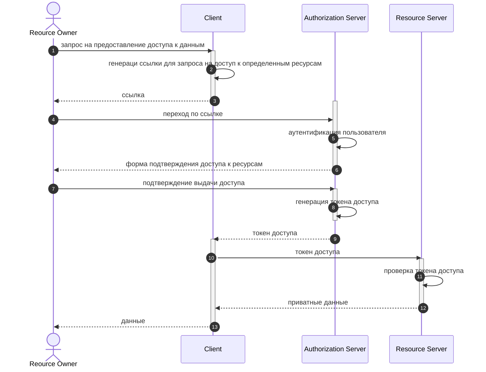

```mermaid
sequenceDiagram

actor RO as Reource Owner

participant C as Client

participant AS as Authorization Server

participant RS as Resource Server

autonumber

RO->>C: запрос на предоставление доступа к данным

activate C

C->>C: генераци ссылки для запроса на доступ к определенным ресурсам

C-->>RO: ссылка

deactivate C

activate AS

RO->>AS: переход по ссылке

AS->>AS: аутентификация пользователя

AS-->>RO: форма подтверждения доступа к ресурсам

deactivate AS

  

RO->>AS: подтверждение выдачи доступа

activate AS

AS->>AS: генерация токена доступа

deactivate AS

AS-->>C: токен доступа

activate C

C->>RS: токен доступа

activate RS

RS->>RS: проверка токена доступа

RS-->>C: приватные данные

deactivate RS

C-->>RO: данные

deactivate C
```

fgdfgdf

