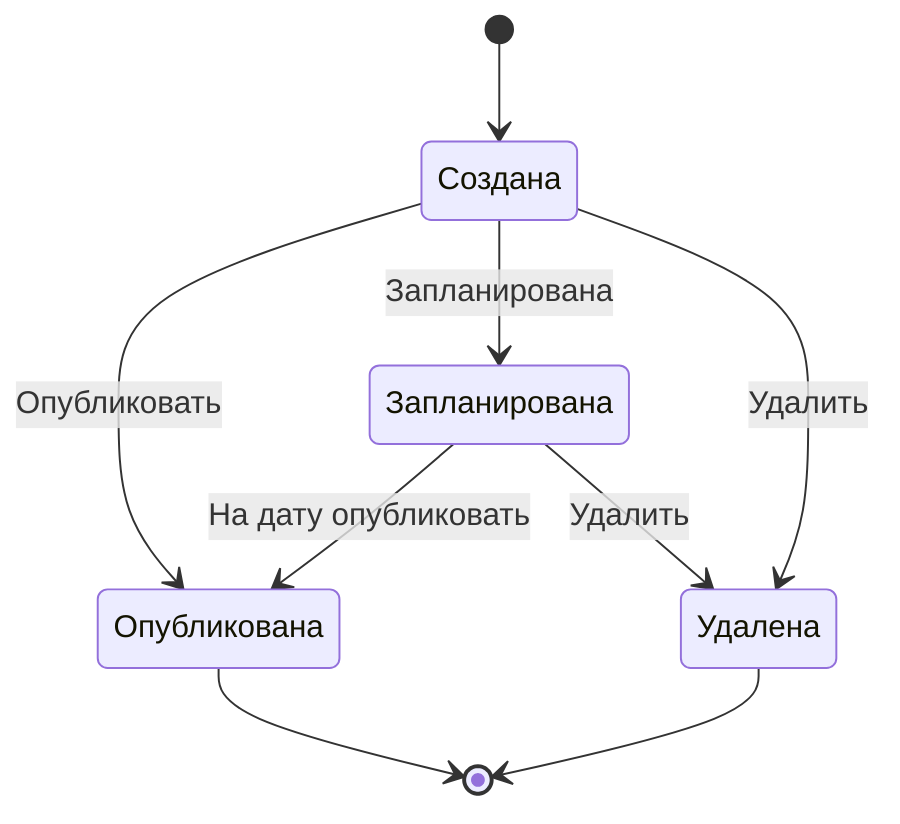

---
tags:
  - ТП-1
  - TUSUR
  - ЛР
links:
  - "[[Тестирование ПО]]"
---

| ФИО                         | Группа | Врема план | Время факт. |
| --------------------------- | ------ | ---------- | ----------- |
| Карманов Арсений Викторович | 571-2  | 2 час      | 1 час       |
# Задача 1

## Классы эквивалентности

1. Сдача билета не позднее, чем за 24 часа до отправления поезда.  
2. Сдача билета менее, чем за 24 часа до отправления поезда, но более чем за 3 часа.
3. Сдача билета за 3 часа до отправления поезда
## Значения для тестирования

1. Время сдачи билета (24 часа до отправления поезда) и ожидаемый результат (полная сумма билета возвращается).
2. Время сдачи билета (менее, чем 24 часа до отправления поезда, но более чем за 3 часа) и ожидаемый результат (Половина от стоимости билета возвращается).
3. Время сдачи билета (за 3 часа до отправления поезда) и ожидаемый результат (сдача билетов прекращается, возврат не производится)
## Тесты на основе классов эквивалентности

1. Проверка полной суммы возврата при сдаче билета за 24 часа до отправки 
2. Проверка частичного возврата при сдаче билета за 20 часов до отправки 
3. Проверка прекращения сдачи билетов за 3 часа до отправки
# Задача 2

1. 17 (нижняя граница - 1)
2. 18 (нижняя граница)
3. 19 (внутри диапазона)
4. 59 (верхняя граница)
5. 60 (верхняя граница + 1)

Эти числа помогут протестировать поведение системы на краевых значениях диапазона возраста.

# Задача 3

Таблица решений для проверки расчета размера скидки:

| Тип пользователя   | Тип покупки (обычная/акционная) | Постоянная скидка | Разовая скидка | Ожидаемый размер скидки |
| ------------------ | ------------------------------- | ----------------- | -------------- | ----------------------- |
| Гость              | Обычная                         | 0%                | 0%             | 0%                      |
| Гость              | Акционная                       | 0%                | 5%             | 5%                      |
| Зарегистрированный | Обычная                         | 5%                | 0%             | 5%                      |
| Зарегистрированный | Акционная                       | 5%                | 5%             | 10%                     |
| Дистрибьютор       | Обычная                         | 15%               | 0%             | 15%                     |
| Дистрибьютор       | Акционная                       | 15%               | 0%             | 15%                     |
|                    |                                 |                   |                |                         |

Список проверок на основе таблицы решений
1. Проверить, что для гостя при обычной покупке размер скидки составляет 0%.
2. Проверить, что для гостя при покупке товара по акции размер скидки составляет 5%.
3. Проверить, что для зарегистрированного пользователя при обычной покупке размер скидки составляет 5%.
4. Проверить, что для зарегистрированного пользователя при покупке товара по акции размер скидки составляет 10%.
5. Проверить, что для дистрибьютора при обычной покупке размер скидки составляет 15%.
6. Проверить, что для дистрибьютора при покупке товара по акции размер скидки также составляет 15%.

# Задача 4

| Тест | Операционная система | Размер экрана | Оперативная память |
|------|-----------------------|--------------|---------------------|
| 1    | Android               | Стандарт     | 2 Гб                |
| 2    | iOS                   | Мини         | 3 Гб                |
| 3    | Android               | Мини         | 4 Гб                |
| 4    | iOS                   | Стандарт     | 2 Гб                |
| 5    | Android               | Стандарт     | 3 Гб                |
| 6    | iOS                   | Стандарт     | 4 Гб                |
| 7    | Android               | Мини         | 2 Гб                |
| 8    | iOS                   | Мини         | 4 Гб                |
| 9    | Android               | Стандарт     | 4 Гб                |
| 10   | iOS                   | Стандарт     | 3 Гб                |

Этот набор тестовых данных позволяет протестировать все возможные комбинации параметров по принципу попарного тестирования.

# Задача 5

